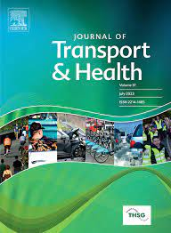

# Racial and income inequalities in access to healthcare in Brazilian cities

R code used in the research paper:

 - Tomasiello, D. B., Vieira, J. P. B., Parga, J. P. F. A., Servo, L. M. S., & Pereira, R. H. M. (2024). **Racial and income inequalities in access to healthcare in Brazilian cities**. *Journal of Transport & Health*, 34, 101722. [https://doi.org/10.1016/j.jth.2023](https://doi.org/10.1016/j.jth.2023)
   - [Ungated PDF of the paper available here](https://www.urbandemographics.org/publication/2024_jth_racial_inequalities_access_health/).

  
The R scripts to reproduce the results are divided into four stages:

-   `1.0_prepare_data.R`
    - Downloads the accessibility data using the [aopdata](https://github.com/ipeaGIT/aopdata) R package
    - Downloads the Mapbox tiles for generating map plots
-   `2.0_Fig3.R`
    - Generates Figure 3
    - Figure is saved in `Figures/`
-   `2.1_Fig1_2_4.R`
    - Generates Figures 1, 2 and 4.
-   `style.R` and `colours.R`
    - Auxiliary scripts used in `2.1_Fig1_2_4.R` to adjust the style and colours of the Figures.

